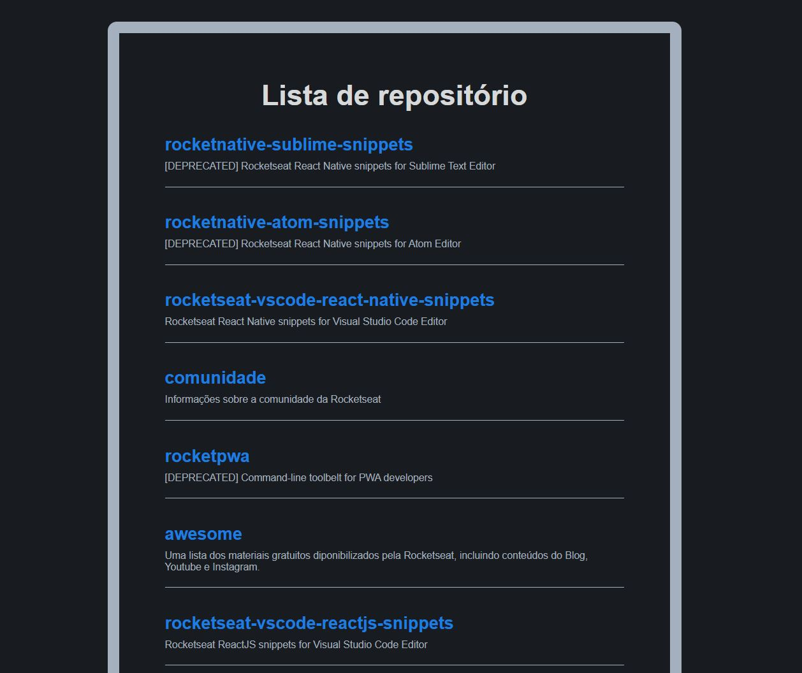

# Github Explorer
<h1 align="center">
  
</h1>

An application developed in Rocketseat Ignite that shows Rocketseat repositories using github api.

This application aimed to train the construction of an application using React and how to manually configure its settings such as babel, webpack, sass loader and Typescript.

The concepts of componentization, immutability, state of components and their hooks such as useState and useEffect, among others, were also reinforced.

# Main Technologies
*Front-end*
- React JS
- Typescript

*Learned skills*
- Configure Babel
- Configure Webpack
- Configure SASS
- Configure Typescrip
- How to use hooks
- How to create components
- How to use github repository api (*https://api.github.com/orgs/rocketseat/repos*)

 